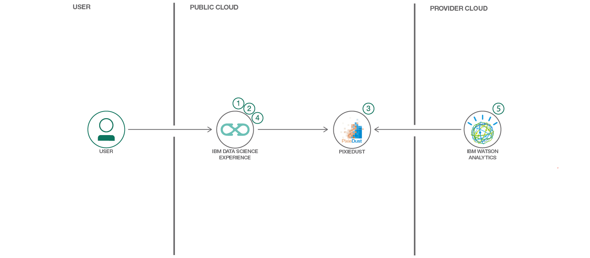
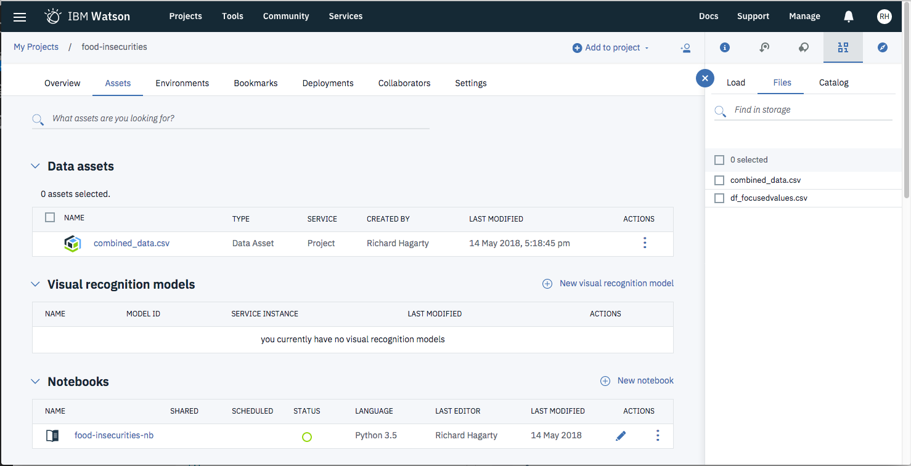

## Visualizing Food Insecurity with Pixie Dust and Watson Analytics

> Data Science Experience is now Watson Studio. Although some images in this code pattern may show the service as Data Science Experience, the steps and processes will still work.

This Code Pattern will guide you through downloading, cleaning and visualizing data using different tools. In particular this Code Pattern showcases food insecurity in the US, along with its associated factors.

Often in data science we do a great deal of work to glean insights that have an impact on society or a subset of it and yet, often, we end up not communicating our findings or communicating them ineffectively to non data science audiences. That's where visualizations become the most powerful. By visualizing our insights and predictions, we, as data scientists and data lovers, can make a real impact and educate those around us that might not have had the same opportunity to work on a project of the same subject. By visualizing our findings and those insights that have the most power to do social good, we can bring awareness and maybe even change. This Code Pattern walks you through how to do just that, with IBM's Watson Studio, Pandas, Pixie Dust and Watson Analytics.

For this particular Code Pattern, food insecurity throughout the US is focused on. Low access, diet-related diseases, race, poverty, geography and other factors are considered by using open government data. For some context, this problem is a more and more relevant problem for the United States as obesity and diabetes rise and two out of three adult Americans are considered obese, one third of American minors are considered obese, nearly ten percent of Americans have diabetes and nearly fifty percent of the African American population have heart disease. Even more, cardiovascular disease is the leading global cause of death, accounting for 17.3 million deaths per year, and rising. Native American populations more often than not do not have grocery stores on their reservation... and all of these trends are on the rise. The problem lies not only in low access to fresh produce, but food culture, low education on healthy eating as well as racial and income inequality.

The government data that I use in this Code Pattern has been conveniently combined into a dataset for our use, which you can find in this repo under combined_data.csv.zip. You can find the original, government data from the US Bureau of Labor Statistics https://www.bls.gov/cex/ and The United States Department of Agriculture https://www.ers.usda.gov/data-products/food-environment-atlas/data-access-and-documentation-downloads/. For the data we use in the second part of this Code Pattern with Watson Analytics, you can go to [df_focusedvalues.csv](https://github.com/IBM/visualize-food-insecurity/blob/visualize-food-insecurity/data/df_focusedvalues.csv) in this repo. You will need a Watson Studio account and a Watson Analytics account to run the duration of this Code Pattern, but you can follow along with the [steps](https://github.com/IBM/visualize-food-insecurity#steps) below!



## Flow

1. Open Watson Studio and create a notebook.
2. Download the data in Watson Studio and explore it.
3. Load Pixie Dust and use for visualizations.
4. Download dataframe as a csv from Watson Studio.
5. Upload the csv to Watson Analytics and visualize.

## Included components

* [IBM Watson Studio](https://www.ibm.com/bs-en/marketplace/data-science-experience): Analyze data using RStudio, Jupyter, and Python in a configured, collaborative environment that includes IBM value-adds, such as managed Spark.
* [IBM Watson Analytics](https://www.ibm.com/watson-analytics): Provides smart data discovery, automated predictive analytics and cognitive capabilities that enables users to interact with data conversationally.
* [Jupyter Notebook](http://jupyter.org/): An open source web application that allows you to create and share documents that contain live code, equations, visualizations, and explanatory text.
* [PixieDust](https://github.com/ibm-watson-data-lab/pixiedust): Provides a Python helper library for IPython Notebook.

## Featured technologies

* [Cloud](https://www.ibm.com/developerworks/learn/cloud/): Accessing computer and information technology resources through the Internet.
* [Data Science](https://medium.com/ibm-data-science-experience/): Systems and scientific methods to analyze structured and unstructured data in order to extract knowledge and insights.
* [Python](https://www.python.org/): Python is a programming language that lets you work more quickly and integrate your systems more effectively.
* [pandas](http://pandas.pydata.org/): A Python library providing high-performance, easy-to-use data structures.

# Watch the Video

[](https://youtu.be/TRvABjKkcqE)

# Steps

This Code Pattern consists of two activities:

* [Run a Jupyter notebook in the IBM Watson Studio](#run-using-a-jupyter-notebook-in-the-ibm-watson-studio).
* [Anaylze the data in Watson Analytics](#analyze-the-data-in-watson-analytics).

## Run using a Jupyter notebook in the IBM Watson Studio

1. [Sign up for the Watson Studio](#1-sign-up-for-the-watson-studio)
2. [Create a new Watson Studio project](#2-create-a-new-watson-studio-project)
3. [Associate a Spark service](#3-associate-a-spark-service)
4. [Create the notebook](#4-create-the-notebook)
5. [Upload data](#5-upload-data)
6. [Run the notebook](#6-run-the-notebook)
7. [Save and Share](#7-save-and-share)

### 1. Sign up for the Watson Studio

Log in or sign up for IBM's [Watson Studio](https://dataplatform.ibm.com).

> Note: if you would prefer to skip the remaining Watson Studio set-up steps and just follow along by viewing the completed Notebook, simply:
> * View the completed [notebook](https://dataplatform.ibm.com/analytics/notebooks/f3b6ba4b-d983-4e87-a9ff-81a2fe3ba843/view?access_token=d152a743efdebcec1d75c816f1bc99eacb55c783c72e94a4d32f791ddb10096b) and its outputs, as is.
> * While viewing the notebook, you can optionally download it to store for future use.
> * Load the example with output from this repository into Watson Studio for analysis `example_output/Diet-Related-Disease-Exploratory.ipynb`
> * When complete, continue this code pattern by jumping ahead to the [Analyze the data in Watson Analytics](#analyze-the-data-in-watson-analytics) section.

### 2. Create a new Watson Studio project

* Select the `New Project` option from the Watson Studio landing page and choose the `Data Science` option.


* To create a project in Watson Studio, give the project a name and either create a new `Cloud Object Storage` service or select an existing one from your IBM Cloud account.


* Upon a successful project creation, you are taken to a dashboard view of your project. Take note of the `Assets` and `Settings` tabs, we'll be using them to associate our project with any external assets (datasets and notebooks) and any IBM cloud services.


### 3. Associate a Spark service

* From the project dashboard view, click the `Settings` tab, click the `+ Add service` button and choose the `Spark` option from the list.


* Create your Spark service by selecting an existing Spark service or creating a new one.


It should now appear in your _Services_ list.


### 4. Create the Notebook

* From the project dashboard view, click the `Assets` tab, click the `+ New notebook` button.


* Give your notebook a name and select your desired runtime, in this case we'll be using the associated Spark runtime.


* Now select the `From URL` tab to specify the URL to the notebook in this repository.


* Enter this URL:

```
https://github.com/IBM/visualize-food-insecurity/blob/master/notebooks/Diet-Related-Disease-Exploratory.ipynb
```

* Click the `Create` button.

### 5. Upload data

* Return to the project dashboard view and select the `Assets` tab.
* Extract the zip file in this repo: `data/combined_data.csv.zip`
* This project has 1 dataset. Upload it as data asset in your project. Do this by loading each dataset into the pop up section on the right hand side. Please see a screenshot of what it should look like below.
* Once complete, go into your notebook in the edit mode (click on the pencil icon next to your notebook on the dashboard).
* Click on the cell with the comment `#Insert Pandas Data Frame`
* Click on the "1001" data icon in the top right. The data files should show up.
* Click on each and select "Insert Pandas Data Frame". Once you do that, a whole bunch of code will show up in the highlighted cell.
* Make sure your `combined_data.csv` is saved as `df_data_1`, so that it is consistent with my notebook and so you do not have to change the code.



### 6. Run the notebook

When a notebook is executed, what is actually happening is that each code cell in
the notebook is executed, in order, from top to bottom.

Each code cell is selectable and is preceded by a tag in the left margin. The tag
format is `In [x]:`. Depending on the state of the notebook, the `x` can be:

* A blank, this indicates that the cell has never been executed.
* A number, this number represents the relative order this code step was executed.
* A `*`, this indicates that the cell is currently executing.

There are several ways to execute the code cells in your notebook:

* One cell at a time.
  * Select the cell, and then press the `Play` button in the toolbar.
* Batch mode, in sequential order.
  * From the `Cell` menu bar, there are several options available. For example, you
    can `Run All` cells in your notebook, or you can `Run All Below`, that will
    start executing from the first cell under the currently selected cell, and then
    continue executing all cells that follow.
* At a scheduled time.
  * Press the `Schedule` button located in the top right section of your notebook
    panel. Here you can schedule your notebook to be executed once at some future
    time, or repeatedly at your specified interval.

### 7. Save and Share

#### How to save your work:

Under the `File` menu, there are several ways to save your notebook:

* `Save` will simply save the current state of your notebook, without any version
  information.
* `Save Version` will save your current state of your notebook with a version tag
  that contains a date and time stamp. Up to 10 versions of your notebook can be
  saved, each one retrievable by selecting the `Revert To Version` menu item.

#### How to share your work:

You can share your notebook by selecting the “Share” button located in the top
right section of your notebook panel. The end result of this action will be a URL
link that will display a “read-only” version of your notebook. You have several
options to specify exactly what you want shared from your notebook:

* `Only text and output`: will remove all code cells from the notebook view.
* `All content excluding sensitive code cells`:  will remove any code cells
  that contain a *sensitive* tag. For example, `# @hidden_cell` is used to protect
  your dashDB credentials from being shared.
* `All content, including code`: displays the notebook as is.
* A variety of `download as` options are also available in the menu.

## Analyze the data in Watson Analytics

1. [Download our new dataframe from Watson Studio](#1-download-our-new-dataframe-from-watson-studio)
2. [Upload our new dataframe csv into Watson Analytics](#2-upload-our-new-dataframe-csv-into-watson-analytics)
3. [Check out the discoveries that Watson Analytics offers](#3-check-out-the-discoveries-that-watson-analytics-offers)
4. [Suggest different relationships to visualize in the display section of Watson Analytics](#4-suggest-different-relationships-to-visualize-in-the-display-section-of-watson-analytics)

### 1. Download our new dataframe from Watson Studio

The last section of the notebook involves steps to download a dataframe from Watson Studio so that it can be used in Watson Analytics. For convenience, that data frame file (`df_focusdvalues.csv`) is also available in this repo and can be found [here](https://github.com/IBM/visualize-food-insecurity/blob/visualize-food-insecurity/data/df_focusedvalues.csv). Download either version of the csv file for use in the following steps. The description of the data values can be found [here](https://github.com/IBM/visualize-food-insecurity/blob/mjmyers/data/Variable%20list.xlsx).

### 2. Upload our new dataframe csv into Watson Analytics

Once you create an account and login to [IBM Watson Analytics](https://www.ibm.com/watson-analytics) you can upload the csv you just downloaded and use it in your next steps. Do this in the "data" section and push "New data". This should only take a few moments to load.

> Note: If you are using a free trial version of Watson Analytics, the data download may fail due to storage limits. In this case, delete any pre-loaded sample data sets to make room for the `df_focusdvalues.csv` data file.


### 3. Check out the discoveries that Watson Analytics offers

Once you've set up your account, you can see that the Watson plaform has three sections: data, discover and display. You uploaded your data to the "data" section, but now you'll want to go to the "discover" section. Under "discover" you can select your dataframe dataset for use. Once you've selected it, the Watson platform will suggest different insights to visualize. You can move forward with its selections or create your own, or both. You can take a look at mine here (you'll need an account to view): https://ibm.co/2xAlAkq or see the screen shots attached to this repo. You can also go into the "display" section and create a shareable layout like mine (again you'll need an account): https://ibm.co/2A38Kg6.


### 4. Suggest different relationships to visualize in the display section of Watson Analytics

You can see that with these visualizations the user can see the impact of food insecurity by state, geographically distributed and used aid such as reduced school lunches, a map of diabetes by state, a predictive model for food insecurity and diabetes (showcasing the factors that, in combination, suggest a likelihood of food insecurity), drivers of adult diabetes, drivers of food insecurity, the relationship with the frequency of farmers market locations, food insecurity and adult obesity, as well as the relationship between farmers markets, the percent of the population that is Asian, food insecurity and poverty rates.

## Analyzing output

By reviewing our visualizations both in Watson Studio and Watson, we learn that obesity and diabetes almost go hand in hand, along with food insecurity. We can also learn that this seems to be an inequality issue, both in income and race, with Black and Hispanic populations being more heavily impacted by food insecurity and diet-related diseases than those of the White and Asian populations. We can also see that school-aged children who qualify for reduced lunch are more likely obese than not whereas those that have a farm-to-school program are more unlikely to be obese.

Like many data science investigations, this analysis could have a big impact on policy and people's approach to food insecurity in the U.S. What's best is that we can create many projects much like this in a quick time period and share them with others by using Pandas, Pixie Dust as well as Watson's predictive and recommended visualizations.


# Links

* [Create Watson Studio Notebooks](https://datascience.ibm.com/docs/content/analyze-data/creating-notebooks.html)
* [Bureau of Labor Statistics](https://www.bls.gov/cex/)
* [Food Environment Atlas](https://www.ers.usda.gov/data-products/food-environment-atlas/data-access-and-documentation-downloads/)

# Learn more

* **Data Analytics Code Patterns**: Enjoyed this Code Pattern? Check out our other [Data Analytics Code Patterns](https://developer.ibm.com/code/technologies/data-science/)
* **AI and Data Code Pattern Playlist**: Bookmark our [playlist](https://www.youtube.com/playlist?list=PLzUbsvIyrNfknNewObx5N7uGZ5FKH0Fde) with all of our Code Pattern videos
* **Watson Studio**: Master the art of data science with IBM's [Watson Studio](https://datascience.ibm.com/)
* **Spark on IBM Cloud**: Need a Spark cluster? Create up to 30 Spark executors on IBM Cloud with our [Spark service](https://console.bluemix.net/catalog/services/apache-spark)

# License
This code pattern is licensed under the Apache Software License, Version 2.  Separate third party code objects invoked within this code pattern are licensed by their respective providers pursuant to their own separate licenses. Contributions are subject to the [Developer Certificate of Origin, Version 1.1 (DCO)](https://developercertificate.org/) and the [Apache Software License, Version 2](http://www.apache.org/licenses/LICENSE-2.0.txt).

[Apache Software License (ASL) FAQ](http://www.apache.org/foundation/license-faq.html#WhatDoesItMEAN)
